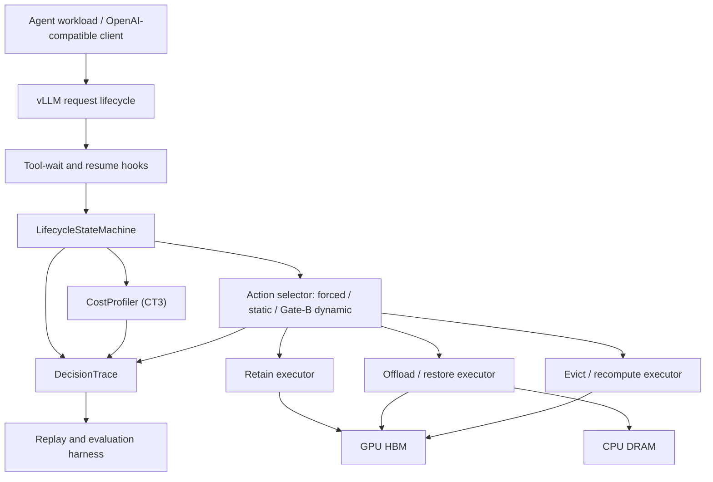
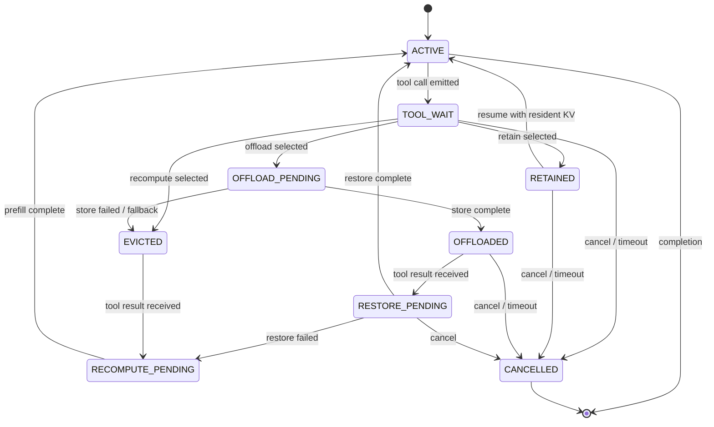

# Architecture

> Status: `roadmap` proposal
>
> No component in this document is a current-vLLM implementation unless an exact
> artifact is linked. Engine-independent Phase 0 contracts are the only shipped
> code at the time of this review.

## 1. Design Principle

Separate action selection from mechanism without moving correctness outside the
runtime:

- Gate A uses forced actions; later phases may use static selectors.
- A dynamic policy estimates costs and chooses an action only after Gate B.
- The runtime state machine owns transitions, concurrency, and fallback.
- Executors adapt supported vLLM retain, native offload/restore, or recompute
  paths; dependency transfer code is not candidate-owned.
- DecisionTrace records the causal chain for evaluation.

Use official vLLM extension points where they preserve required semantics. Modify
engine core only when an explicit missing contract is demonstrated.

### Ownership Matrix

| Responsibility | Owner | Mainline status |
|---|---|---|
| Lifecycle claim/epoch, legal transitions, idempotence, stale-completion fencing | Candidate lifecycle runtime | Required CT1-CT2 |
| Forced/static action orchestration, fallback, cancellation, cleanup, DecisionTrace | Candidate lifecycle runtime | Required CT1-CT2 |
| Hook/event translation and executor adapters | Candidate integration, over audited vLLM contracts | Required CT1-CT2 |
| Shared block residency/refcounts, eviction, PagedAttention, model execution | vLLM physical data plane | Reused dependency |
| Native D2H/H2D store/restore and tier capacity semantics | vLLM physical data plane | Reused dependency |
| Cost profiling and boundary benchmark | Candidate harness | Required CT3 |
| Dynamic selector | Candidate policy | Conditional CT4 after Gate B |

A tracing-only hook does not own the lifecycle contract. Gate A must prove that
candidate code changes at least one real transition, fallback, or cleanup outcome
and that ordinary requests retain the default vLLM path.

## 2. System Overview



## 3. Main Components

### LifecycleStateMachine

Owns logical lifecycle claims, epochs, legal transitions, idempotence,
asynchronous-completion fencing, fallback, cancellation, cleanup, and completion
semantics.

Proposed interface:

```text
on_tool_wait(event) -> Decision
on_resume(event) -> ResumePlan
on_cancel(event) -> CleanupPlan
on_transfer_complete(event) -> StateTransition
on_transfer_failure(event) -> FallbackPlan
```

It does not estimate policy costs or directly move tensors. The exact object
carrying this state is unresolved until the pinned-vLLM audit; it may be a
lifecycle claim over compatible prefix references rather than a long-lived
request object.

### CostProfiler

Builds measured curves for:

```text
prefill latency by prompt tokens, batch, model, and load
D2H store latency by KV bytes and contention
H2D restore latency by KV bytes and contention
decision overhead
HBM pressure and admission effects
```

Profiles are versioned by model, KV dtype, parallel configuration, engine commit,
hardware topology, and runtime configuration.

### Action Selector and Conditional LifecyclePolicy

Gate A consumes an explicit forced action. Static baselines later consume declared
configuration. A dynamic `LifecyclePolicy` is proposed only after Gate B and would
consume an immutable decision snapshot plus return one action and explanation.

```text
DecisionInput:
  request_id
  lifecycle_epoch
  model_fingerprint
  prefix_tokens
  kv_bytes
  estimated_gap
  estimated_resume_probability
  gpu_cache_pressure
  queue_depth
  transfer_pressure
  latency_slo

Decision:
  action: retain | offload | recompute
  estimated_costs
  selected_reason
  policy_version
```

If Gate B passes, the first dynamic policy is analytic and deterministic. Learned
prediction is not a dependency or current roadmap commitment.

### Executors

`RetainExecutor` is included only when the pinned runtime exposes maintainable
retention semantics. It adapts supported priority/TTL behavior rather than
claiming ownership of the engine's cache manager.

`OffloadExecutor` orchestrates vLLM's native asynchronous D2H/H2D mechanism and
reports completion or failure back to the project contract. The underlying
transfer/tiering implementation remains vLLM-owned.

`RecomputeExecutor` releases reusable state and prepares resume through normal
prefill. It must distinguish intentional recompute from accidental cache miss.

### DecisionTrace

The proposed integration must produce a structured trace record for every
lifecycle event:

```text
request_id
session_id
lifecycle_epoch
event_time
event_type
state_before / state_after
model and runtime fingerprint
decision inputs
estimated retain/offload/recompute costs
selected action and reason
actual store/restore/recompute timing
matched prefix tokens
fallback cause
SLO outcome
```

DecisionTrace is part of the runtime contract, not optional logging. It makes
policy effects attributable and enables deterministic replay.

## 4. Lifecycle State Machine



## 5. State and Correctness Invariants

1. A request has one monotonically increasing lifecycle epoch.
2. A resume event may activate only the current epoch.
3. One lifecycle claim/epoch has at most one terminal requested outcome. This
   does not grant a session ownership of physical blocks: shared/content-addressed
   blocks retain engine-defined reference, residency, and eviction ownership.
4. Restored KV is accepted only when model, tokenizer/template, KV dtype,
   attention layout, parallel configuration, and token hash are compatible.
5. A transfer failure cannot silently produce partial reuse; it falls back to
   recompute or fails the request explicitly.
6. Cancellation is idempotent and prevents stale transfer completion from
   resurrecting the request.
7. Ordinary non-agent requests remain on the default fast path.

## 6. Cache Identity

The compatibility fingerprint is a proposed safety boundary. Gate A must map it
to fields current vLLM actually exposes before implementation. Candidate fields
include:

```text
model identity and revision
tokenizer identity and revision
chat-template version
exact prefix token hashes
KV dtype and layout
attention backend assumptions
tensor/pipeline/context parallel configuration
engine and connector compatibility version
```

This fingerprint is a correctness boundary, not merely a cache-key optimization.

## 7. Scheduling and Resource Semantics

Retain consumes HBM over time. Offload consumes destination capacity and transfer
bandwidth. Recompute consumes future GPU compute and may delay unrelated decode
requests. CT3 measurement, and any later selector, must therefore include resource
pressure rather than compare isolated request latency only.

MVP resource scope:

```text
one vLLM process
one 24 GB GPU
tensor parallel size 1
GPU HBM
node-local CPU DRAM
fixed preemption configuration
```

NVMe, remote stores, multi-replica routing, and cross-engine sharing are separate
extensions because each adds independent correctness and performance questions.

## 8. Failure Handling

| Failure | Required behavior |
|---|---|
| D2H store failure | Mark offload unavailable; release or retain according to safe fallback |
| H2D restore failure | Recompute if compatible prompt tokens remain available |
| Resume during store | Serialize by epoch; either complete store then restore or cancel store safely |
| Cancel during restore | Suppress stale completion and release temporary capacity |
| Duplicate resume | Process once; record duplicate as a trace event |
| CPU tier full | Apply configured admission/eviction policy; never overwrite live data |
| Backend restart | Invalidate local metadata and reconcile before reuse |
| Stale cache identity | Reject reuse and recompute |

## 9. vLLM Integration Boundary

As of the 2026-07-13 review, vLLM upstream has native CPU offload, a merged/released
multi-tier framework, and experimental per-request selective offload. Those are
dependencies, not candidate contributions. A prior context-aware token
priority/duration proposal closed without merging, but this does not prove that
the pinned target has no usable retention behavior. Gate A must pin a concrete
tag and commit and verify:

```text
whether request lifecycle hooks expose tool-wait and resume semantics
whether per-request offload requests and actual outcomes are expressible
whether retention can use a supported priority/TTL API
whether DecisionTrace can observe actual block outcomes
whether fallback can be implemented without broad scheduler changes
which object owns block references, shared residency, and asynchronous completion
```

If retention requires a large fork, the project must either narrow to
offload/recompute or isolate a minimal retention API contribution.

## 10. Planned Candidate Code Surface

Exact vLLM anchors wait for Gate A, but full CT1-CT3 completion must leave an
inspectable code surface equivalent to:

```text
src/toolgap_kv/contracts/       lifecycle identity, events, actions, trace schema
src/toolgap_kv/runtime/         state machine, controller, invariants, cleanup
src/toolgap_kv/integrations/    pinned-vLLM hooks, event translation, outcome adapter
src/toolgap_kv/executors/       retain/offload/recompute orchestration adapters
src/toolgap_kv/observability/   DecisionTrace sink, counters, timing attribution
src/toolgap_kv/workloads/       deterministic tool-gap compiler and replay driver
src/toolgap_kv/benchmarks/      profiler, experiment runner, result validation
tests/unit/                     transitions, epochs, idempotence, fallback
tests/integration/              real vLLM paths, default-path bypass, output checks
tests/fault/                    failure, cancel, duplicate/late completion, cleanup
patches/                        only a proven missing vLLM contract, pinned by commit
experiments/                    manifests, immutable raw traces, summaries, commands
```

The final file names may differ, but none of the first seven responsibilities can
be replaced by a diagram. Candidate code is expected to be several thousand lines
across runtime, adapters, tests, and harnesses; LOC is not an acceptance metric.
The auditable vLLM core patch should remain small or Gate A must reconsider the
seam.

## 11. Future Architecture, Not Mainline

A research extension may add a `StorageTier` abstraction for DRAM, NVMe, or
remote KV systems and a cache-aware router for multiple replicas. A production
extension may add multi-tenant quotas, admission control, HA metadata, and
orchestration. These extensions must not be used to claim completion of the
single-node lifecycle mechanism.
