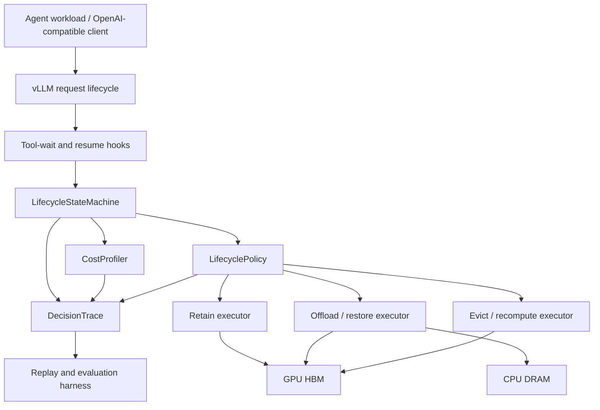
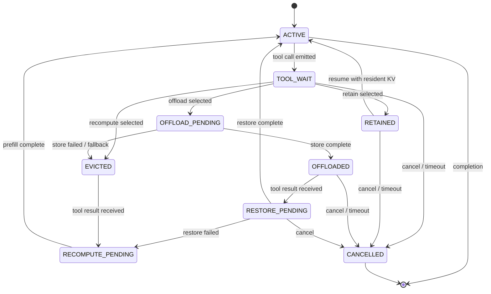

# Architecture

## 1. Design Principle

Separate policy from mechanism without moving correctness outside the runtime:

- The policy estimates costs and chooses an action.
- The runtime state machine owns transitions, concurrency, and fallback.
- Executors perform retain, offload/restore, or recompute.
- DecisionTrace records the causal chain for evaluation.

Use official vLLM extension points where they preserve required semantics. Modify
engine core only when an explicit missing contract is demonstrated.

## 2. System Overview



## 3. Main Components

### LifecycleStateMachine

Owns request state, epochs, legal transitions, and completion semantics.

Proposed interface:

```text
on_tool_wait(event) -> Decision
on_resume(event) -> ResumePlan
on_cancel(event) -> CleanupPlan
on_transfer_complete(event) -> StateTransition
on_transfer_failure(event) -> FallbackPlan
```

It does not estimate policy costs or directly move tensors.

### CostProfiler

Builds measured curves for:

```text
prefill latency by prompt tokens, batch, model, and load
D2H store latency by KV bytes and contention
H2D restore latency by KV bytes and contention
decision overhead
HBM pressure and admission effects
```

Profiles are versioned by model, KV dtype, parallel configuration, engine commit,
hardware topology, and runtime configuration.

### LifecyclePolicy

Consumes an immutable decision snapshot and returns one action plus an explanation.

```text
DecisionInput:
  request_id
  lifecycle_epoch
  model_fingerprint
  prefix_tokens
  kv_bytes
  estimated_gap
  estimated_resume_probability
  gpu_cache_pressure
  queue_depth
  transfer_pressure
  latency_slo

Decision:
  action: retain | offload | recompute
  estimated_costs
  selected_reason
  policy_version
```

The first policy is analytic and deterministic. Learned prediction is not an MVP
dependency.

### Executors

`RetainExecutor` applies bounded retention or priority semantics.

`OffloadExecutor` schedules asynchronous D2H/H2D movement through the selected
vLLM offload mechanism. It reports completion or failure back to the state machine.

`RecomputeExecutor` releases reusable state and prepares resume through normal
prefill. It must distinguish intentional recompute from accidental cache miss.

### DecisionTrace

Every lifecycle event produces a structured trace record:

```text
request_id
session_id
lifecycle_epoch
event_time
event_type
state_before / state_after
model and runtime fingerprint
decision inputs
estimated retain/offload/recompute costs
selected action and reason
actual store/restore/recompute timing
matched prefix tokens
fallback cause
SLO outcome
```

DecisionTrace is part of the runtime contract, not optional logging. It makes
policy effects attributable and enables deterministic replay.

## 4. Lifecycle State Machine



## 5. State and Correctness Invariants

1. A request has one monotonically increasing lifecycle epoch.
2. A resume event may activate only the current epoch.
3. At most one terminal storage action owns a block set at a time.
4. Restored KV is accepted only when model, tokenizer/template, KV dtype,
   attention layout, parallel configuration, and token hash are compatible.
5. A transfer failure cannot silently produce partial reuse; it falls back to
   recompute or fails the request explicitly.
6. Cancellation is idempotent and prevents stale transfer completion from
   resurrecting the request.
7. Ordinary non-agent requests remain on the default fast path.

## 6. Cache Identity

The compatibility fingerprint must include at least:

```text
model identity and revision
tokenizer identity and revision
chat-template version
exact prefix token hashes
KV dtype and layout
attention backend assumptions
tensor/pipeline/context parallel configuration
engine and connector compatibility version
```

This fingerprint is a correctness boundary, not merely a cache-key optimization.

## 7. Scheduling and Resource Semantics

Retain consumes HBM over time. Offload consumes destination capacity and transfer
bandwidth. Recompute consumes future GPU compute and may delay unrelated decode
requests. The policy must therefore observe resource pressure rather than compare
isolated request latency only.

MVP resource scope:

```text
one vLLM process
one GPU or one local tensor-parallel group
GPU HBM
node-local CPU DRAM
fixed preemption configuration
```

NVMe, remote stores, multi-replica routing, and cross-engine sharing are separate
extensions because each adds independent correctness and performance questions.

## 8. Failure Handling

| Failure | Required behavior |
|---|---|
| D2H store failure | Mark offload unavailable; release or retain according to safe fallback |
| H2D restore failure | Recompute if compatible prompt tokens remain available |
| Resume during store | Serialize by epoch; either complete store then restore or cancel store safely |
| Cancel during restore | Suppress stale completion and release temporary capacity |
| Duplicate resume | Process once; record duplicate as a trace event |
| CPU tier full | Apply configured admission/eviction policy; never overwrite live data |
| Backend restart | Invalidate local metadata and reconcile before reuse |
| Stale cache identity | Reject reuse and recompute |

## 9. vLLM Integration Boundary

As of the last review, vLLM has native CPU offload and a pluggable CPU offload
`CachePolicy`, while the context-aware retention proposal has not become a stable
mainline contract. The calibration sprint must pin a concrete commit and verify:

```text
whether request lifecycle hooks expose tool-wait and resume semantics
whether per-request offload decisions are expressible
whether retention can use a supported priority/TTL API
whether DecisionTrace can observe actual block outcomes
whether fallback can be implemented without broad scheduler changes
```

If retention requires a large fork, the project must either narrow to
offload/recompute or isolate a minimal retention API contribution.

## 10. Future Architecture, Not Mainline

A research extension may add a `StorageTier` abstraction for DRAM, NVMe, or
remote KV systems and a cache-aware router for multiple replicas. A production
extension may add multi-tenant quotas, admission control, HA metadata, and
orchestration. These extensions must not be used to claim completion of the
single-node lifecycle mechanism.
