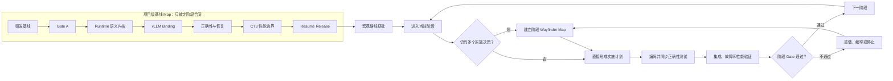

# ToolGap-KV 项目级基线 Map 设计

> 设计状态：七个阶段合同已于 2026-07-18 逐项获得用户认可，本文已通过书面复核；
> 等待发布 GitHub Wayfinder Map。
>
> 适用范围：从当前 Phase 0 到 Phase 6 Resume Release Gate 的项目级规划。
>
> 本文只设计 Wayfinder Map，不实施 Runtime、不修改 vLLM，也不发布 GitHub Issues。

## 1. 目标

建立一张粗粒度项目级 Wayfinder Map，使 ToolGap-KV 在开始长期开发前先锁定：

- 每个阶段要回答的工程问题；
- candidate-owned 交付物；
- 系统完成该阶段后产生的可观察效果；
- 进入条件、退出证据、缩窄和停止分支；
- 何时需要建立独立阶段 Map；
- 何时达到可写入简历并接受面试追问的水平。

项目级 Map 完成表示宏观研发合同已经通过评审，不表示代码已经实现。核心项目以
Phase 6 Resume Release Gate 为完成边界。Phase 7 CT4 仅在 Gate B 通过后以独立 Map
启动，不是核心项目毕业条件。

## 2. 当前基线

截至 2026-07-18：

- engine-independent lifecycle action、event 和 DecisionTrace scaffolding 已存在；
- `make check` 通过十八个测试和 repository validator；
- 没有 pinned current-vLLM integration、候选人自有 Runtime、GPU 测量或性能结果；
- 当前完成状态只能表述为 Phase 0 scaffolding `shipped`；
- runtime-centered Phase 0-7 设计尚未完全成为全仓唯一口径；
- 工作树包含大量未提交文档和规划修改；
- GitHub Issue Tracker 配置已存在，但发布前仍需恢复 `gh` 身份验证并检查已有 Issues。

因此第一个顶层 ticket 必须锁定研发基线，不能直接跳到 Gate A 编码。

## 3. 方案比较

### 方案 A：三合同 Map

只建立 Integration、Correctness、Performance、Release 四个 tickets。

优点是结构短。缺点是会再次把 Runtime 语义内核、vLLM Binding 和异步正确性压缩在
同一合同中，无法体现状态机的真实工程量，也难以定义独立退出门槛。

### 方案 B：全实施 Map

现在一次性创建接口、文件、测试、benchmark 和实验级 tickets。

优点是看起来完整。缺点是 Gate A 尚未确认 vLLM authority、completion visibility、
retention seam 和 failure seam，提前展开会制造大量错误精度，并违反 Wayfinder 的
fog-of-war 原则。

### 方案 C：七个阶段合同 tickets

项目级 Map 只定义阶段的范围、效果和证据。进入具体阶段时，如果仍存在多个实施决策，
再建立独立阶段 Map；如果路线已清楚，直接形成实施计划。

采用方案 C。它在整体可评审和局部可调整之间取得最小充分平衡。

## 4. 两层规划模型



项目级 Map 与阶段 Map 的职责不同：

- 项目级 Map 回答要走哪些阶段，以及每个阶段到什么程度才结束；
- 阶段 Map 回答当前阶段具体怎么走；
- implementation plan 和普通开发 Issues 承载施工；
- evidence ledger、decision cards 和 raw artifacts 证明施工结果。

不得将同一个顶层阶段合同 ticket 直接改造成 Map。阶段合同关闭后，如需展开，应新建
独立阶段 Map，并在两者之间建立链接。

## 5. Map Issue 设计

### 5.1 标题

```text
ToolGap-KV：从 Phase 0 到 Resume Release 的研发基线
```

标签：`wayfinder:map`。

### 5.2 Body

```markdown
## Destination

敲定 ToolGap-KV 从当前 Phase 0 到 Phase 6 Resume Release Gate 的宏观研发合同。

每个阶段必须明确：
- 要回答的工程问题；
- candidate-owned 交付物；
- 对系统产生的可观察效果；
- 进入条件、退出证据和失败分支；
- 何时需要建立阶段级 Wayfinder Map。

本 Map 完成表示项目宏观路线已经通过评审，不表示代码已经实现。
Phase 6 是核心项目完成和简历发布边界；Phase 7 CT4 是条件扩展。

## Notes

- 项目定位：面向 LLM Serving、Inference Runtime 和 AI Infra 的招聘 work sample。
- 领域语言以 CONTEXT.md 为准。
- 第一性原理和证据门槛以 FIRST_PRINCIPLES.md 与 INTERVIEW_MAP.md 为准。
- 已有重大决策引用 DECISIONS.md，不在 Map 中复制。
- 每个 ticket 只解决一个阶段合同，不能承载数周实施。
- 每次会话最多关闭一个 ticket。
- 每个 resolution 必须记录 scope、owned deliverables、observable effect、exit
  evidence、rejected alternatives、stop conditions 和 next-stage entry。
- claim state 只能是 roadmap、shipped、experimentally validated 或 simulated。
- 本 Map 为 planning-only；不执行代码修改、性能实验或 Resume claim 发布。

## Decisions so far

<!-- 初始为空；只索引本 Map 已关闭 tickets 的 resolution。 -->

## Not yet specified

- Gate A 最终固定的 vLLM tag、commit 和可维护 seam；
- retain 是否存在可维护实现，还是主线缩窄为 offload/recompute；
- vLLM 中真实 block/refcount、store/load completion 和 visibility contract；
- lifecycle claim 与 resumed request 的最终身份映射；
- 状态机的精确状态、事件和 operation identity；
- 可确定性注入的最高价值 failure seam；
- 最终 GPU、模型、上下文和压力实验配置；
- 公平 static TTL 或 action-only comparator 是否可表达；
- 各阶段是否确实需要独立阶段 Map。

## Out of scope

- 在项目级 Map 中设计类、函数、文件和 patch 细节；
- 把 DecisionTrace instrumentation 当成 Lifecycle Runtime；
- 多引擎、多节点、RDMA、NVMe 或 remote tier；
- 强制引入 LMCache、Mooncake、AIBrix 或 Kubernetes；
- CUDA kernel、PagedAttention 或 vLLM 物理 KV 数据面的重写；
- learned predictor 和 workflow-wide scheduler；
- production-scale 或 distributed-system claim；
- 将 Phase 7 动态 selector 作为核心项目毕业要求。
```

## 6. Resolution 合同

七个顶层 tickets 初始均使用 `wayfinder:grilling`。Ticket body 只写待解决的问题；答案在
用户参与的 grilling session 后写入 resolution comment。

每个 resolution comment 使用相同结构：

```markdown
## Decision

最终选择和核心理由。

## Owned deliverables

候选人必须实现或维护的代码、测试和实验产物。

## Observable effect

阶段实施完成后新增的可观察、可验证系统行为。

## Exit evidence

测试、trace、命令、raw result 和 decision card。

## Rejected alternatives

至少一个被拒绝方案及理由。

## Stop or narrow conditions

出现什么证据时必须重做、缩窄或停止。

## Out of scope

本阶段明确不做的工作。

## Next-stage entry conditions

进入下一阶段必须满足的条件。
```

## 7. 顶层 Tickets

### 7.1 锁定项目研发基线与唯一口径

类型：`wayfinder:grilling`。

```markdown
## Question

当前哪些 artifacts、阶段顺序、预算和 claim state 构成正式研发起点，必须完成哪些
收敛工作才能进入 Gate A？
```

预期收敛范围：

- 全仓统一为 Phase 0-6 核心路线；
- Phase 7 明确为条件扩展；
- 核心预算统一为 240-385 小时；
- 当前状态保持 Phase 0；
- 十八个现有测试的职责和 claim 边界被准确记录；
- 当前未提交规划被决定为保留、合并、历史化或删除。

阶段实施后的效果是形成干净、可复现、无互相冲突的开发起点。该 ticket 无 blocker，
是初始 frontier。

### 7.2 定义 Gate A 的可行性证明与停止分支

类型：`wayfinder:grilling`。

```markdown
## Question

Gate A 必须证明什么真实 current-vLLM 行为和 candidate ownership，才能合理投入后续
Lifecycle Runtime 开发？
```

预期收敛范围：

- source capability matrix；
- pinned tag/commit 选择原则；
- forced CPU restore、full recompute 和可选 retain 的证明；
- behavior-changing controller vertical slice；
- removal/bypass 与 unchanged-default-path tests；
- source-audited fault/fallback fixture；
- extension、minimal patch、narrow 和 stop 分支。

Gate A 采用三级边界：

1. 官方 extension 足够时直接集成；
2. extension 不足但缺少一个窄契约时，允许实现由 failing/conformance test 证明的最小、
   可审计 vLLM core patch；
3. 若项目必须接管 block manager/refcount、PagedAttention、完整 eviction/preemption、
   CPU tier 数据面或大范围 scheduler fork，则缩窄项目或停止。

Core patch 是否可接受由缺失契约的语义边界判断，不使用任意 LOC 阈值。Patch 必须固定
base commit、独立归档、保留默认路径回归测试，并将 patch ownership 与 ToolGap-KV
Runtime ownership 分开。

阶段实施后的效果是证明项目不是外部 benchmark：至少一个 candidate-owned in-process
行为真实改变 transition、fallback 或 cleanup 结果。该 ticket 被“锁定项目研发基线与
唯一口径”阻塞。

### 7.3 定义 Lifecycle Runtime 语义内核的最小 Ownership

类型：`wayfinder:grilling`。

```markdown
## Question

Runtime 必须拥有哪些身份、状态迁移、并发和失败语义，才能称为 candidate-owned
Lifecycle Runtime，而不是 trace adapter？
```

预期收敛范围：

- Gate A 确认的真实 lifecycle authority；
- lifecycle claim identity 和 monotonic epoch；
- asynchronous operation identity；
- legal transition、terminal outcome 和 compatibility decision；
- duplicate event idempotence；
- stale completion fencing；
- fallback、cancellation、cleanup 和 DecisionTrace contract。

vLLM 继续拥有 physical blocks/refcounts、shared-prefix residency、eviction/preemption、
PagedAttention、模型执行、CPU tier 以及 D2H/H2D 数据传输。语义内核不直接移动 tensor，
不复制 block manager，不提前增加多引擎、远端 tier、StorageTier 或动态策略抽象。

阶段实施后的效果是：即使 completion 重复、迟到，或请求已取消、进入新 epoch，Runtime
仍能唯一判断事件有效性、fallback 和 cleanup。退出证据包括 transition table、全部合法
迁移测试以及非法迁移、duplicate、stale epoch、repeated cleanup 测试。该 ticket 被
“定义 Gate A 的可行性证明与停止分支”阻塞。

### 7.4 定义 current-vLLM Runtime Binding 的行为闭环

类型：`wayfinder:grilling`。

```markdown
## Question

Runtime 如何与 current-vLLM 的真实请求、cache 和 asynchronous completion 对接，形成
requested action 到 observed action 的完整闭环？
```

预期收敛范围：

- tool-wait、resume、cancel、store/load completion 事件翻译；
- retain、CPU offload/restore 和 recompute executor orchestration；
- forced/static action，排除 dynamic selector；
- actual hit/miss、matched/recomputed tokens、queue 和 timing attribution；
- requested/observed/fallback allowlist 与路径证明；
- ordinary request default-path bypass；
- controller removal/bypass 与 unchanged-default-path regression。

Observed action 必须由引擎直接证据确认，不能由端到端延迟猜测。若 Gate A 使用最小 vLLM
patch，patch 只暴露缺失契约，主要 lifecycle 语义仍归 ToolGap-KV Runtime 所有。

阶段实施后的效果是一条真实请求能从 tool gap 进入 candidate Runtime，执行真实 GPU
reuse、CPU restore、recompute 或显式 fallback；删除控制器后该行为消失，但普通请求
不受影响。该 ticket 被“定义 Lifecycle Runtime 语义内核的最小 Ownership”阻塞。

### 7.5 定义 Runtime 正确性与恢复证据

类型：`wayfinder:grilling`。

```markdown
## Question

哪些故障与竞态必须被确定性覆盖，才能证明失败、过期或部分完成的 KV 不会影响恢复
请求？
```

强制覆盖五类风险：

1. store/restore failure；
2. cancel during transfer；
3. duplicate resume/completion；
4. completion after epoch change；
5. repeated cleanup。

Tokens 和 compatible runtime identity 是 authoritative state，KV 是 derived materialization。
失败或部分完成的 KV 不得可见；安全结果是 recompute、显式失败或 source-audited fallback。

本项目不宣称分布式 exactly-once，只承诺当前进程和当前 lifecycle claim/epoch 内的幂等
事件处理、stale-completion fencing、至多一个有效 terminal outcome 和可验证资源清理。

所有状态迁移和竞态必须有 deterministic unit/adapter tests；至少一个高价值故障必须在
真实 vLLM Binding 上确定性复现。退出证据包括 no-cache/recompute output equivalence、
CPU/GPU 临时容量回归基线以及 DecisionTrace 因果链。该 ticket 被 Runtime 语义内核和
current-vLLM Binding 两个 tickets 阻塞。

### 7.6 定义 CT3 的性能边界与全局代价

类型：`wayfinder:grilling`。

```markdown
## Question

如何公平测量 retain、CPU offload 和 recompute 的收益边界，并证明帮助 resumed request
没有不可接受地伤害活跃请求？
```

采用“真实成本校准 + 三个端到端场景切片”，不做多维笛卡尔积。

成本校准包括：

- prefill latency × context length × active load；
- D2H store × KV bytes × concurrent transfers；
- H2D restore × KV bytes × concurrent transfers；
- Runtime enabled/bypass overhead；
- HBM pressure 对 admission、preemption 和 active decode 的影响。

三个场景切片是：

1. restore vs recompute：扫描 context/KV size，得到 `R=T_restore/T_recompute`；
2. retain vs release：扫描 tool-gap duration 和 `M=active_KV/usable_HBM`；
3. 并发与恢复突发：扫描 `U=arrival_rate/service_rate` 和 correlated resume burst。

Comparators 包括 stock vLLM default、forced recompute、always offload，以及 seam 支持时的
soft retention。Tuned static TTL/action-only comparator 留到 Phase 6 Gate B0。

请求指标是 resume TTFT p50/p95/p99；全局约束是 active-request p95/p99、Goodput@SLO
和 preemption；同时记录 GPU/CPU KV、D2H/H2D、queue、token accounting 和 fallback。
任何 resume 改善必须同时报告 active-request 和 Goodput 账。

统计协议包括 warmup 分离、variance pilot、重复运行、action 顺序轮换、原始结果保留和
明确负向 workload。单 GPU 结果只声明当前 testbed 的有效边界。

阶段实施后的效果是一张可复现的 retain/offload/recompute 边界图，同时说明获胜条件、
losing region 和全局吞吐、尾延迟、显存机会成本。该 ticket 被 current-vLLM Binding 和
Runtime 正确性与恢复两个 tickets 阻塞。

### 7.7 定义 Resume Release Gate 与 CT4 分流标准

类型：`wayfinder:grilling`。

```markdown
## Question

哪些证据同时成立后，项目才能放入简历；什么实验结论允许或禁止继续开发动态 selector？
```

Gate B0 必须建立最强且公平的 static comparator：所有策略复用相同 executors；公平
retention/TTL seam 存在时调优 static TTL，否则使用可表达的 static threshold/action-only
baseline；参数只在 calibration split 调优。如果公平 comparator 不可表达，记录
negative-conformance 并退休 CT4。

Resume Release Gate 要求：

- CT1 Integration、CT2 Correctness、CT3 Measured Boundary 都有真实证据；
- DC1、DC2、DC3、DC4、DC7 至少五张 mandatory cards 关闭；
- 每个 material claim 都有 owned path、环境/workload、reproduction command、raw
  result、rejected alternative、negative case 和 validity boundary；
- 干净环境复现成功；
- 正确性、故障和性能记录完整保留；
- README、ROADMAP、ARCHITECTURE、EVALUATION、INTERVIEW_MAP、NARRATIVE 和
  DECISIONS claim state 一致；
- 完成一次四十五分钟 adversarial interview drill；
- 最终 Resume bullet 的每个名词、动词和数字都能映射到 evidence ledger。

Phase 6 不强制性能提升。边界结果、静态策略充分、recompute 占优或仅窄区间获益都可构成
有效工程结论，但会改变最终 Resume wording。CT4 只有在至少两个可达、可复现 regime
偏好不同 action，静态策略不足、executor parity 成立且测量 margin 大于噪声时，才以
独立 Map 启动。

阶段实施后的效果是仓库成为可复现、可审计、能接受源码、状态机、故障和性能连续追问的
LLM Serving work sample。该 ticket 被“定义 CT3 的性能边界与全局代价”阻塞。

## 8. Blocking 关系

发布 Issues 后使用 GitHub native dependency：

```text
锁定项目研发基线与唯一口径
  -> 定义 Gate A 的可行性证明与停止分支
      -> 定义 Lifecycle Runtime 语义内核的最小 Ownership
          -> 定义 current-vLLM Runtime Binding 的行为闭环
          -> 定义 Runtime 正确性与恢复证据
              -> 定义 CT3 的性能边界与全局代价
                  -> 定义 Resume Release Gate 与 CT4 分流标准
```

精确关系：

- “定义 Gate A 的可行性证明与停止分支” blocked by “锁定项目研发基线与唯一口径”；
- “定义 Lifecycle Runtime 语义内核的最小 Ownership” blocked by Gate A；
- “定义 current-vLLM Runtime Binding 的行为闭环” blocked by Runtime 语义内核；
- “定义 Runtime 正确性与恢复证据” blocked by Runtime 语义内核和 Runtime Binding；
- “定义 CT3 的性能边界与全局代价” blocked by Runtime Binding 和正确性与恢复；
- “定义 Resume Release Gate 与 CT4 分流标准” blocked by CT3。

这些是合同评审依赖，不是实际工程完成依赖。项目级 Map 关闭后，真实阶段实施仍必须按
Phase 0 到 Phase 6 的 Gate 顺序推进。

## 9. 项目级 Map 完成条件

项目级 Map 仅在以下条件全部满足时关闭：

1. 七个顶层 tickets 均通过用户参与的 grilling resolution；
2. 每个 resolution 都包含统一合同的八个部分；
3. 各阶段 scope、effect、evidence 和 stop branch 不互相矛盾；
4. Phase 6 保持核心完成边界，Phase 7 保持条件扩展；
5. 所有依赖使用 GitHub native blocking；
6. Map 的 Decisions so far 只索引 closed tickets，不复制其完整答案；
7. 尚不能由当前证据回答的实施细节仍留在 fog，不被伪装成决定；
8. Map 没有产生任何 shipped、GPU 或性能 claim。

## 10. 阶段实施闭环

项目级 Map 关闭后，每个阶段按相同闭环推进：

1. 读取当前阶段合同和前序 evidence pack；
2. 判断是否存在两个以上会改变实现方向的未知决策；
3. 有真实 fog 时建立阶段 Map，否则直接写 implementation plan；
4. 阶段 Map 每次只解决一个 frontier ticket；
5. Map 关闭后生成实施计划和开发 Issues；
6. 编码过程中同步编写 unit、invariant 和 fault tests；
7. 阶段末执行 integration、failure、performance 或 reproducibility gate；
8. 更新 evidence ledger、decision cards、claim states 和 negative results；
9. Gate 通过后进入下一阶段；未通过则重做、缩窄或停止。

测试不能等代码全部完成后再设计。Acceptance contract 和 falsifiable expectation 必须在
实施前冻结；unit/invariant tests 与编码同步；阶段末验证负责真实集成、故障、性能和干净
环境复现。

## 11. 保存与发布顺序

1. 本规格先作为单独 draft commit 保存，不包含其他工作树修改；
2. 用户进行书面复核；修改意见通过后续独立 commit 落实；
3. 书面复核通过后恢复并验证 `gh` 身份；
4. 查询现有 open/closed Issues，避免重复 Map；
5. 创建项目级 Map Issue 并添加 `wayfinder:map`；
6. 第一遍创建七个 child tickets；
7. 第二遍添加 native blocking relationships；
8. 查询 frontier，确认只有“锁定项目研发基线与唯一口径”可领取；
9. 停止，不在 charting session 中同时解决第一个 ticket。

## 12. 设计验证标准

本设计在发布前必须满足：

- 没有 TBD、TODO 或未解释占位符；
- Destination、tickets、dependencies 和完成条件一致；
- 每个 ticket 可在一个长会话内完成阶段合同评审；
- tickets 不承载数周实施；
- Gate A 允许窄 missing-contract patch，但不允许静默扩大为 broad fork；
- Runtime 语义、Binding、Correctness 和 Performance 保持独立阶段；
- Phase 5 计算 resumed request 与 active-request 的全局账；
- Phase 6 不以强制性能提升为完成条件；
- Phase 7 不属于核心项目 Destination；
- 当前仓库状态不被误写为 Runtime 或 GPU evidence 已交付。
