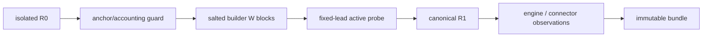

# A0.2 Stock Sufficiency：HND 公平基线与分阶段 Harness 设计

> 状态：`roadmap`
>
> 设计目标：在不实现 ToolGap runtime 的前提下，为 A0.2 建立一个能够公平比较 stock APC
> (S0) 与 stock APC + 原生 CPU KV offload (S1) 的、可证伪的实现边界。

## 1. 目的与已成立的前提

本设计只服务于 A0.2 的唯一问题：在受控容量压力代理下，S0/S1 是否已经覆盖可观察、可归因
且有经济头寸的前台 resume miss，以及是否留下 foreground resume 与 active probe 的全局
代价边界。

以下事实已经由独立实验验证，设计可消费但不得扩张其含义：

- A0.1R 在固定 canonical pair 上验证了 192 个完整 prefix token 的 stock APC admission；
- 新的三 ordinal preflight 验证：在 `enable_chunked_prefill=True` 时，R0 cold、R1 cached
  `=192`、LCP `=199`、semantic span 相等；
- 该 preflight 只覆盖单请求路径，不能证明压力下的 chunked-prefill accounting。

本设计不证明真实 tool-gap wall-clock LRU、CPU restore 性能、ToolGap lifecycle runtime、动态
policy，或生产负载收益。

## 2. 必须固定的公平性条件

### 2.1 HND 是 S0/S1 的共同 layout

pinned vLLM 的 `OffloadingConnector.get_required_kvcache_layout()` 返回 `HND`；没有 connector
时，KV connector helper 默认选择 `NHD`。因此只给 S1 加 offload 会同时改变 KV layout，不能
再把差异归因于 CPU tier。

每个 A0.2 子进程都必须在 import vLLM 前设置：

```text
VLLM_KV_CACHE_LAYOUT=HND
```

S0 和 S1 都必须在 fresh OS process 内启动。manifest 保存环境变量、resolved layout、block
size、GPU block capacity 和 page/block bytes。若任一项不同，comparative run 为 `invalid_run`。

### 2.2 S1 只使用原生配置路径

S1 使用 `LLM(kv_offloading_size=<GiB>, kv_offloading_backend="native")`。在该 pin 上，vLLM
由 `CacheConfig` 解析为 `KVTransferConfig(kv_connector="OffloadingConnector")` 并传入
`cpu_bytes_to_use`。driver 不实例化 connector、不写 custom manager、不设置 request-scoped
offload 限额。

S1 启动后必须断言：

```text
resolved connector == OffloadingConnector
resolved cpu_bytes_to_use >= 1.5 * C_blocks * block_bytes
GPU C_blocks == paired S0 C_blocks
```

这里 `C_blocks` 与 `block_bytes` 均来自 HND S0 calibration；`kv_offloading_size` 使用向上取整
GiB 计算。任何容量或 layout 不等价都不能以“配置略有不同”继续比较。

### 2.3 accounting 仍是不可变 oracle

前台 canonical pair 在每个 comparative run 都重新生成。只有同时满足：

```text
R0 cached = 0
R0/R1 semantic span = [178,198)
LCP = 199
R1 prompt prefix[:192] hash = registered anchor
R1 cached is a valid integer, block-aligned, and 0 <= cached <= 192
```

无压力 `R1.cached=192` 已由 chunked-prefill preflight 单独验证；它是 A0.2 的 baseline
contract，不是压力后的每 run 通过条件。压力后的 block-aligned `R1.cached<192` 正是候选
GPU-prefix miss，只有在上列 token anchor 与计数边界都成立时才可进入后续归因。缺失、非
block-aligned、超出 192 或超过 prompt 长度的计数才是 `accounting_contract_change`，暂停
matrix；它们不是 S0 miss、S1 restore 或性能数据。

## 3. 推荐 harness 结构

建立独立目录 `experiments/A0.2-stock-sufficiency/`。A0.1R 与 chunked-prefill preflight 的
runner 保持冻结，不被重构或参数化。

```text
experiments/A0.2-stock-sufficiency/
  a02.py                 pure cell, schedule, verdict, atomic bundle helpers
  payloads.py            deterministic salted background payload construction
  run_calibration.py     HND capacity and payload-block calibration
  run_preflight.py       S1 observability + ten-run probe timing preflight
  run_matrix.py          exactly one registered comparative ordinal
  test_a02.py            CPU-only contracts
  README.md              scope, commands, artifact contract
  raw/.gitkeep           ignored immutable GPU evidence
```

不引入 framework、数据库、长期 daemon、HTTP server、custom connector、共享全局 cache service
或 A1 runtime 代码。

## 4. 四段执行门

### Gate 0：calibration

S0/HND fresh process 读取实际 `C_blocks`、block size、block bytes、GPU memory provenance。它将
确定性 salted background payload 映射为完整 block 数，并验证第一个完整 block 后不与前台
prefix 共享。

输出 `calibration.json`，冻结：三个 `M={0.50,1.10,1.30}` 对应的 `floor(M*C_blocks)`、payload
hash 和 S1 所需 CPU GiB。它不提交 R1、不产出 S0/S1 胜负、不运行 90-run matrix。

### Gate 1：S1 connector observability

S1/HND fresh process 验证 native config 实际创建 `OffloadingConnector`，CPU capacity 不小于
calibration 导出的下界，并执行一个受控 store/load 观察。connector aggregation stats 的读取会
清空当前 counters，故 preflight 只能登记一个固定的 post-R1 snapshot 点，不能在一次 run 中
轮询后再把累积数解释为单次 transfer。

该 gate 的结果分两类：

- connector/config/capacity 无法成立：停止 A0.2，记录 `invalid_configuration`；
- native load 可发生但无可维护的 load start/end 或与 R1 的关联证据：允许继续 matrix 的
  hit/miss 观察，但所有依赖 restore/probe overlap 的 Continue 判据固定为 `inconclusive`。

### Gate 2：active-probe timing

十次 non-comparative HND/S0 timing trial 只选一个预先固定的 probe-to-R1 lead offset。目标是
至少 9/10 在 R1 提交时仍有一个 probe in flight。不能因某个 comparative cell 失败而改变 cap
或 lead offset。

未达到 9/10 时，停止并修正 workload 规格；不开始 matrix。

### Gate 3：frozen comparative matrix

tracked schedule 将 ordinal `1..90` 映射为：

```text
(L in {2048,8192,16384}, M in {0.50,1.10,1.30},
 pair in 1..5, policy in {S0,S1}, order in {AB,BA}, deterministic nonce)
```

`run_matrix.py --ordinal N --attempt A` 是唯一 GPU comparative 入口；CLI 不允许临时传入 L、M、
policy、payload、seed 或 connector knob。每个 ordinal 启动独立 process，只执行该 schedule
item；pair 内 S0/S1 共享 nonce、payload hashes 与时间表，AB/BA 在 schedule 中预生成。

任何 invalid/contract-change 不覆盖旧 raw bundle，按 attempt 新建目录，并暂停依赖该 cell 的
后续 ordinal，由人审查而不是自动补跑。

## 5. 每 run 的数据流与 artifact



`a02.py` 不导入 vLLM；它只负责 schedule 不变量、cell validity、阈值 `theta`、pair verdict 与
原子 bundle 写入。runner 将 engine-owned IDs、timestamps、resolved config、payload hashes 和
connector observations 原样传入。

每个 raw bundle 至少包含：

```text
manifest.json       commit, model, HND env, resolved engine and connector config
foreground.json     R0/R1 engine IDs, spans, LCP, cached/recomputed accounting
workload.json       cell, nonce, W target/observed blocks, payload hashes, ordering
probe.json          submit/finish timestamps, R1-arrival liveness evidence
connector.json      S1 config, one stats snapshot, available transfer/event evidence
timing.json         queue, prefill, TTFT/service fields plus missing reasons
verdict.json        valid / stop / continue / inconclusive classification inputs
```

S0 writes `connector.json` with explicit `disabled` status rather than omitting it。不能用缺文件表达
“没有 connector”。

## 6. 判决纪律

实现必须保留原 A0.2 spec 的 Stop / Continue / Inconclusive 语义，并新增以下优先级：

1. provenance、layout、CPU capacity、anchor 或 output oracle 异常：`invalid_run`；
2. cached counter 缺失、非 block-aligned、超过 192/实际 prompt 长度：
   `accounting_contract_change`，暂停 matrix；
3. builder/probe 先决条件失败：cell `inconclusive`，不选择性补跑；
4. connector transfer time 不可见：不阻止记录 S1 hit/miss，但禁止以 directional trade-off
   进入 A1；
5. 只有有效 runs 才进入原有 `theta`、4/5 pair consistency 与跨 cell 判断。

## 7. 测试与实现顺序

实施计划必须按以下依赖执行：

1. CPU pure contracts：schedule 有且仅有 90 项、AB/BA 配对、immutable bundle、anchor 和
   verdict priority；
2. HND calibration runner：只允许输出 calibration artifact；
3. S1 configuration/observability preflight：先测 resolved connector/capacity，再测其观察边界；
4. probe timing preflight：十次规则和固定 lead offset；
5. matrix runner：只消费已提交 calibration/preflight artifact，且无自由实验参数；
6. result aggregation：只读取 raw bundle，不重新解释或篡改单 run verdict。

每一步先写 CPU failing test，再实现最小代码；前一阶段没有 committed evidence artifact 时，
不得开始下一阶段。

## 8. 对既有文档的预期修订

在实现计划获批后，需做以下受控文档更新：

- 更新 `A0.2-stock-sufficiency-spec.md` 的前置条件：消费 A0.1R 和 chunked-preflight，而非
  历史 A0.1 `pass`；
- 将唯一 scheduler pin 固定为 `enable_chunked_prefill=True`、`VLLM_KV_CACHE_LAYOUT=HND`；
- 将 S1 CPU GiB 的计算、resolved connector/layout 断言、connector observability 限制写入规格；
- 更新 `docs/agent-kv/README.md`：A0.2 不再被 configuration audit 阻塞，状态为已完成配置
  preflight、待 reviewed stock-sufficiency implementation；
- 以新的 decision record 记录 D027 第一个失败条件已被排除，但 A0.2 仍未证明性能或 runtime
  价值。

这些修改不改变 D026 历史负结果，也不把当前 preflight 重写成 A0.2 比较证据。
